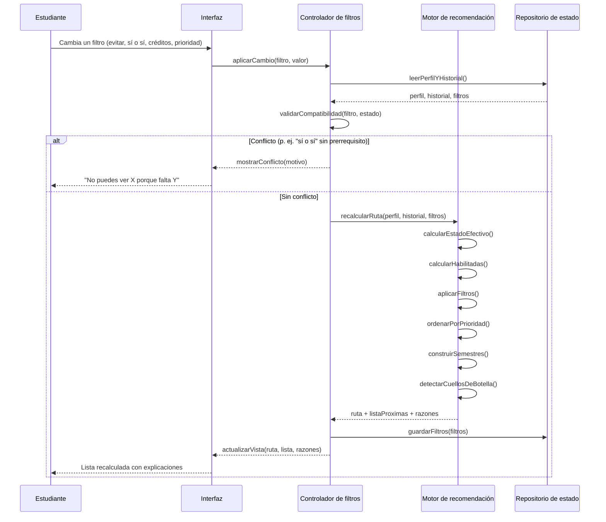
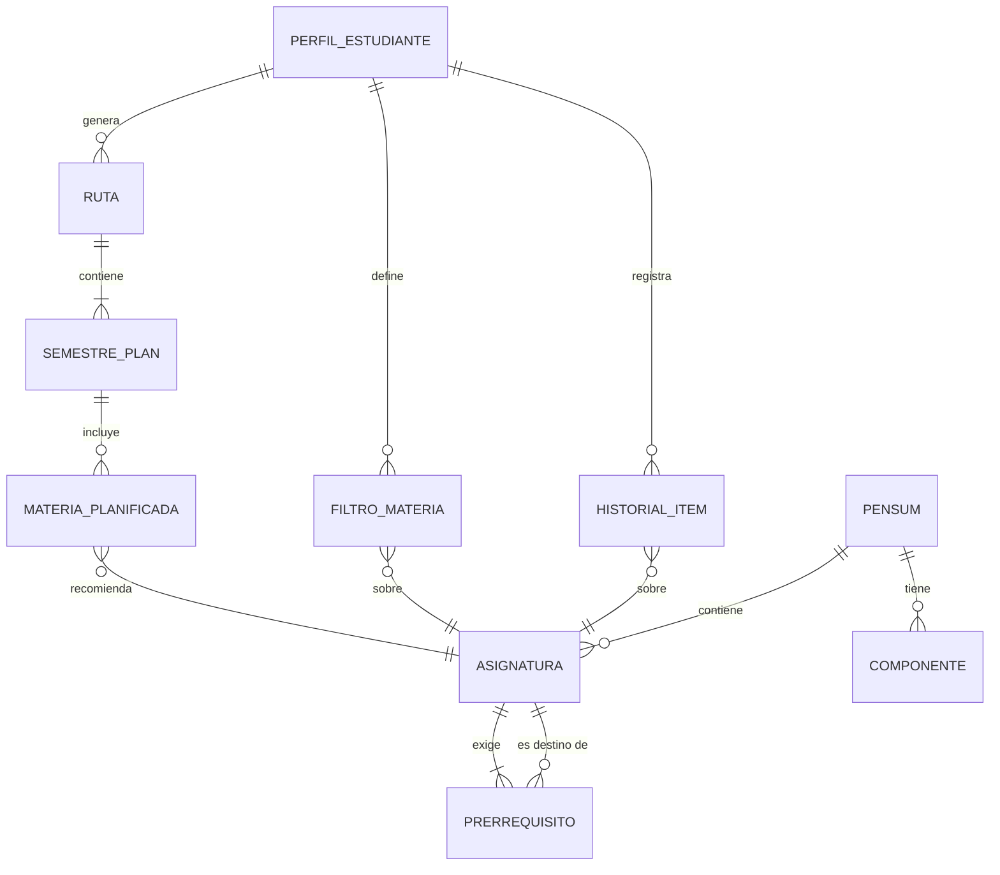
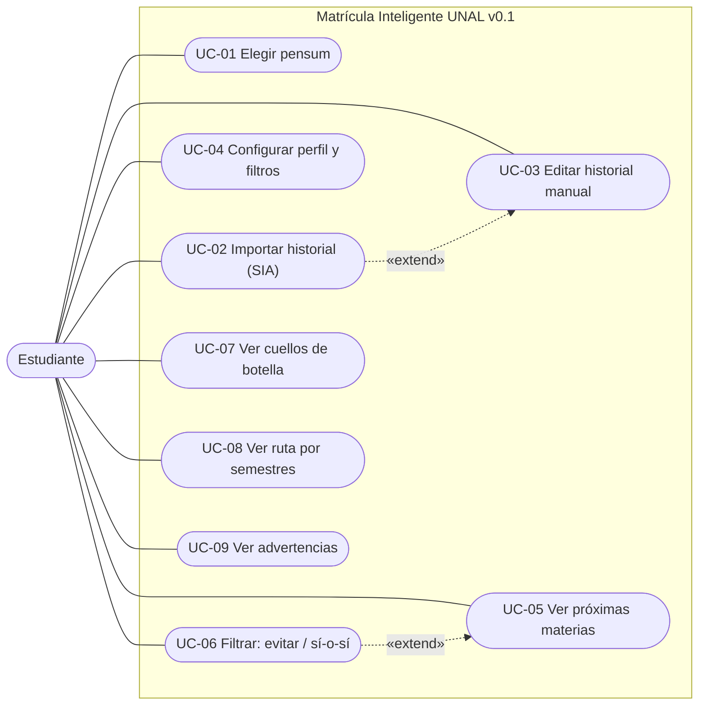
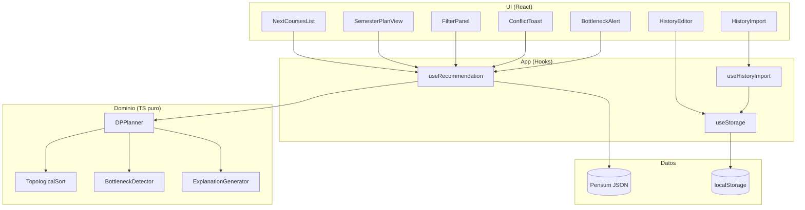

# Matrícula Inteligente UNAL — Especificación Técnica Consolidada

> **Versión**: v0.1 · **Estado**: Aprobada para implementación · **Proyecto de portafolio**
> Universidad Nacional de Colombia · Facultad de Minas · Ingeniería de Sistemas e Informática

Este documento consolida la visión, los requisitos, las reglas de negocio, el modelo de datos, los algoritmos, la arquitectura, la interfaz y las decisiones del proyecto. Reemplaza y unifica los artefactos previos de exploración (idea general, product discovery, requisitos, modelo de dominio, casos de uso, lógica de recomendación y arquitectura de software).

---

## Índice

1. [Visión general](#1-visión-general)
2. [Problema](#2-problema)
3. [Objetivos](#3-objetivos)
4. [Alcance](#4-alcance)
5. [Usuarios y actores](#5-usuarios-y-actores)
6. [Requisitos funcionales](#6-requisitos-funcionales)
7. [Requisitos no funcionales](#7-requisitos-no-funcionales)
8. [Reglas de negocio](#8-reglas-de-negocio)
9. [Glosario](#9-glosario)
10. [Casos de uso y flujos principales](#10-casos-de-uso-y-flujos-principales)
11. [Arquitectura](#11-arquitectura)
12. [Componentes y responsabilidades](#12-componentes-y-responsabilidades)
13. [Modelo de datos](#13-modelo-de-datos)
14. [Persistencia](#14-persistencia)
15. [Diagramas](#15-diagramas)
16. [Algoritmos](#16-algoritmos)
17. [Parser del historial (SIA)](#17-parser-del-historial-sia)
18. [Extractor de pensum (build-time)](#18-extractor-de-pensum-build-time)
19. [Interfaz y experiencia](#19-interfaz-y-experiencia)
20. [Integraciones](#20-integraciones)
21. [Seguridad y privacidad](#21-seguridad-y-privacidad)
22. [Restricciones y supuestos](#22-restricciones-y-supuestos)
23. [Decisiones arquitectónicas](#23-decisiones-arquitectónicas)
24. [Riesgos](#24-riesgos)
25. [Plan de pruebas](#25-plan-de-pruebas)
26. [Roadmap incremental](#26-roadmap-incremental)
27. [Trazabilidad](#27-trazabilidad)
28. [Decisiones pendientes](#28-decisiones-pendientes)

---

## 1. Visión general

**Matrícula Inteligente UNAL** es una aplicación web que, cuando el plan de estudios de un estudiante se rompe (por ejemplo, al perder una materia), le recomienda **qué matricular a continuación según su situación personal**.

No muestra grafos ni nodos: muestra una **lista corta de próximas materias**, cada una con su razón, que se recalcula al instante cuando el estudiante activa o desactiva un filtro.

El proyecto se construye en **dos etapas**:

- **Etapa 1 — Ruta de materias** (este documento). Funciona sola.
- **Etapa 2 — Armado de horario**. Se apoya en la etapa 1; su forma exacta se explora al terminar la etapa 1.

---

## 2. Problema

Planear la matrícula es una decisión con restricciones cruzadas. Mientras el estudiante sigue el plan predefinido de la universidad, todo funciona. **El problema aparece cuando el plan se rompe**: el estudiante pierde una materia, no sabe qué ruta le queda y decide a ciegas.

Restricciones que cruzan la decisión:

- Prerrequisitos que bloquean materias posteriores.
- Componentes y agrupaciones con créditos exigidos.
- Requisitos por porcentaje de avance de un componente.
- Un cupo de créditos limitado y un promedio mínimo.

Los sistemas oficiales (SIA) sirven para **inscribir**, pero casi nunca para **planear**. Hoy el estudiante resuelve con hojas de cálculo, consejos de compañeros o ensayo y error.

---

## 3. Objetivos

**Objetivo general**: que el estudiante tome una mejor decisión de matrícula, con menos riesgo de atrasarse cuando su plan se rompe.

**Objetivos específicos**:

- Recomendar las próximas materias a matricular según el estado real y los filtros del estudiante.
- Explicar cada recomendación, bloqueo o conflicto en lenguaje claro.
- Recalcular la recomendación al instante ante cualquier cambio de filtro.
- Mostrar el costo (en semestres y, a futuro, en cupo y promedio) de cada decisión.
- Detectar cuellos de botella: materias que, si se dejan para tarde, atrasan la graduación.

**Métricas de éxito**:

| Métrica | Definición | Cómo se mide |
|---|---|---|
| Uso espontáneo | 10 estudiantes que la usan sin pedírselo. "Usar" = generó una recomendación y la usó al matricular. | Conteo de usuarios que llegan por grupos estudiantiles o boca a boca. |
| Cambio de decisión | 3 estudiantes declaran que matricularon algo distinto a lo que habrían hecho sin la herramienta. | Pregunta corta después de matricular. |
| Calidad de recomendación | Cero errores de prerrequisitos en lo recomendado. | Pruebas contra el pensum. |
| Calidad de extracción | Pocas correcciones manuales sobre el pensum extraído. | Porcentaje de nodos corregidos por el usuario. |

---

## 4. Alcance

### 4.1 Alcance de v0.1 (MVP)

- Carrera predeterminada: **Ingeniería de Sistemas e Informática, Facultad de Minas**.
- Importación del historial académico pegando el texto copiado del SIA, con vista previa editable.
- Edición manual del historial como alternativa.
- Configuración de créditos mínimos y máximos por semestre.
- Ruta sugerida (modo normal): rápida y explicable, recalcula al cambiar un filtro.
- Validación de prerrequisitos con explicación de bloqueos.
- Filtros "materia a evitar (no este semestre)" y "materia sí o sí", con conflictos explicables.
- Prioridad: terminar rápido, cuidar el promedio, carga cómoda.
- Semestre objetivo opcional con indicador "llega / no llega".
- Simulación "¿y si pierdo esta?" (nueva ruta y costo en semestres).
- Detección de cuellos de botella (solo sobre materias necesarias para graduarse).
- Advertencias no bloqueantes (mínimo de créditos de la UNAL, materias "en curso" antiguas, cupos de componente incompletos, libre elección pendiente).
- **Cupos por componente (tipología)**: el motor solo recomienda materias de un componente cuyo cupo está pendiente; los excedentes y los códigos fuera del pensum cuentan como libre elección (RF-22, RN-10).
- **Avance por componente en la interfaz** (`ProgressPanel`): aprobados/exigidos por tipología, con inscritos y excedentes (parcial de RF-18).
- Historial "en curso": no se recomienda y cuenta como inscritos del cupo de su componente.
- Exportación de la ruta (JSON y texto legible).

### 4.2 Fuera de alcance de v0.1

- Validación del avance porcentual de los Seminarios y del trabajo de grado (RN-08, RN-09; los datos ya se cargan, el motor no los evalúa hasta v0.2).
- Cupo de créditos y PAPA (v0.2).
- Lista de verificación de requisitos de grado no académicos: inglés B1, Saber Pro, paz y salvo (v0.2).
- Homologaciones, convalidaciones y validaciones (fuera de alcance del proyecto).
- Correquisitos (no existen en el pensum de Sistemas).
- Comparación de escenarios lado a lado (v0.3/v1.5).
- Ruta mínima verificada con A* (v1.0).
- Subida de pensum en tiempo de ejecución (solo carreras predeterminadas; extracción build-time).
- Otras universidades, países o facultades (solo Facultad de Minas).
- Conexión automática con sistemas oficiales, cupos en tiempo real, cuentas de usuario y pagos.
- Armado de horarios (Etapa 2).

---

## 5. Usuarios y actores

| Actor | Rol |
|---|---|
| **Estudiante** | Actor principal. Usa la herramienta para decidir su matrícula. Semestres 3 a 7 de Ingeniería de Sistemas, con o sin carga laboral. |
| **Administrador del pensum** | Mantiene las carreras predeterminadas: carga, corrige y versiona los planes. Hoy es el autor del proyecto; se modela aparte para dejar claro que no lo hace el estudiante. No es un actor de la aplicación en ejecución. |

**Persona de referencia** — Camilo, 5.º semestre de Ingeniería de Sistemas, UNAL, Facultad de Minas, trabaja medio tiempo. Sigue el plan de la universidad, pero perdió una materia y no sabe qué ruta le queda. Decide a ciegas y no ve lo que le cuesta cada opción.

---

## 6. Requisitos funcionales

Los requisitos se priorizan con el criterio MoSCoW (Must / Should / Could). El nivel indica en qué versión entra.

| ID | Requisito | Prioridad | Nivel |
|---|---|---|---|
| RF-01 | Seleccionar carrera/pensum predeterminado. | Must | v0.1 |
| RF-02 | Importar el historial académico pegando el texto copiado del SIA, con vista previa editable. | Must | v0.1 |
| RF-03 | Registrar y editar el historial manualmente (aprobadas, perdidas, en curso). | Must | v0.1 |
| RF-04 | Configurar créditos mínimos y máximos por semestre, sin valores predeterminados. | Must | v0.1 |
| RF-05 | Calcular la **ruta sugerida** (rápida y explicable). | Must | v0.1 |
| RF-06 | Validar prerrequisitos y explicar los bloqueos. | Must | v0.1 |
| RF-07 | Simular la pérdida o cancelación de una materia y mostrar la nueva ruta y el costo en semestres. | Must | v0.1 |
| RF-08 | Detectar cuellos de botella (ruta crítica) y su costo si se evitan. | Must | v0.1 |
| RF-09 | Mostrar las próximas materias a matricular, con razón, y recalcularlas al cambiar un filtro. | Must | v0.1 |
| RF-10 | Filtro "materia a evitar" (no este semestre), que se reactiva en el siguiente. | Must | v0.1 |
| RF-11 | Filtro "materia sí o sí", que explica el conflicto cuando no se puede. | Must | v0.1 |
| RF-12 | Selector de prioridad: terminar rápido, cuidar el promedio o carga cómoda. | Must | v0.1 |
| RF-13 | Semestre objetivo opcional, indicando si la ruta llega a tiempo. | Should | v0.1 |
| RF-14 | Advertencia no bloqueante del mínimo de 10 créditos por periodo de la UNAL. | Should | v0.1 |
| RF-15 | Advertencia no bloqueante de materias "en curso" registradas en periodos antiguos. | Should | v0.1 |
| RF-16 | Exportar/visualizar la ruta por semestre (JSON y texto legible). | Should | v0.1 |
| RF-17 | Pregunta corta posterior a la matrícula: "¿esto cambió lo que ibas a inscribir?". | Could | v0.1 |
| RF-18 | Mostrar créditos por componente y por agrupación, y validar el avance porcentual. | Must | v0.1 (avance por componente en UI); agrupaciones y validación porcentual: v0.2 |
| RF-19 | Mostrar el cupo de créditos restante y cuánto gasta cada decisión. | Must | v0.2 |
| RF-20 | Registrar notas y avisar si el PAPA se acerca al mínimo de 3.0. | Should | v0.2 |
| RF-21 | Lista de verificación de requisitos de grado no académicos (inglés B1, Saber Pro, paz y salvo). | Must | v0.2 |
| RF-22 | Optativas de tecnologías: mínimo 22 créditos, con excedente que cuenta como libre elección. | Must | v0.1 |
| RF-23 | Comparar escenarios lado a lado: semestres, créditos y cupo. | Should | v0.3 |
| RF-24 | Ruta mínima verificada (modo exacto, con límite de tiempo). | Could | v1.0 |
| RF-25 | Elegir la versión del plan o cohorte. | Should | v0.1 (condicional) |

**Etapa 2 (por definir)**: cargar la oferta académica del semestre; generar combinaciones de grupos sin cruces; ordenarlas según preferencias del estudiante; conectar con la etapa 1 para avisar si una materia obliga a un horario imposible.

---

## 7. Requisitos no funcionales

| ID | Requisito |
|---|---|
| RNF-01 | La ruta sugerida se calcula en menos de 2 segundos para un pensum de ~70 materias. La ruta mínima verificada tiene su propio límite de tiempo. |
| RNF-02 | Usabilidad: un estudiante entiende la ruta sin capacitación, comprobado con estudiantes reales. |
| RNF-03 | Mantenibilidad: las reglas de negocio están separadas del código de interfaz. |
| RNF-04 | Auditabilidad: el sistema puede explicar por qué una materia no se puede ver. |
| RNF-05 | Portabilidad: los datos del MVP se guardan en un formato abierto y exportable. |
| RNF-06 | Privacidad: el historial académico es un dato personal; solo el estudiante accede al suyo. Los datos no salen del dispositivo. |
| RNF-07 | Exactitud: cero errores de prerrequisitos en lo recomendado, verificado contra el pensum real. |
| RNF-08 | Se puede usar cómodamente desde el celular. |

---

## 8. Reglas de negocio

Basadas en el Estatuto Estudiantil (Acuerdo 008 de 2008), la política de lengua extranjera (Acuerdo 102 de 2013) y la malla de Ingeniería de Sistemas e Informática de la Facultad de Minas. Las fuentes son de años distintos y el Estatuto pudo modificarse: deben confirmarse con la Secretaría de Facultad antes de fijarlas.

| ID | Regla | Versión |
|---|---|---|
| RN-01 | La nota mínima para aprobar una asignatura es 3.0. | v0.2 |
| RN-02 | Con un PAPA menor a 3.0 se pierde la calidad de estudiante. | v0.2 |
| RN-03 | **Cupo de créditos**: créditos del plan más un cupo adicional (`min(plan/2, 80)`), que se gana de a 2 por crédito aprobado. Los créditos inscritos, incluidos los de materias perdidas, se descuentan del cupo. | v0.2 |
| RN-04 | Cancelar antes de terminar la segunda semana devuelve los créditos al cupo; cancelar después los descuenta. | v0.2 |
| RN-05 | En pregrado se inscriben mínimo 10 créditos por periodo, salvo autorización del Consejo de Facultad. | v0.1 (advertencia) |
| RN-06 | Homologaciones, convalidaciones y validaciones no pueden superar el 50% de los créditos mínimos del plan. | Fuera de alcance |
| RN-07 | Se exige nivel B1 de inglés como requisito de grado. | v0.2 (checklist) |
| RN-08 | Algunas materias piden un porcentaje de avance de un componente además de prerrequisitos (Seminarios 1, 2 y 3). | v0.2 |
| RN-09 | El trabajo de grado exige el 100% de fundamentación y el 80% del componente disciplinar o profesional. | v0.2 |
| RN-10 | Las optativas de tecnologías exigen un mínimo de 22 créditos; el excedente cuenta como libre elección. | v0.1 |

### 8.1 Cadena de los Seminarios (plan de Sistemas)

| Código | Nombre oficial (PDF) | Alias en la interfaz | Créditos | Prerrequisito de materia | Avance exigido |
|---|---|---|---|---|---|
| 3010408 | Fundamentos de Proyectos en Ingeniería | Seminario 1 | 3 | — | 40% Fundamentación |
| 3010407 | Estructuración y Evaluación de Proyectos | Seminario 2 | 3 | 3010408 | 20% Disciplinar |
| 3010439 | Proyecto Integrado de Ingeniería | Seminario 3 | 4 | 3010407 | 100% Fundamentación **y** 70% Disciplinar |

Todos los requisitos son condiciones **AND**: deben cumplirse todas.

> **Nota de dato**: `3010414` (Introducción a la Ingeniería Administrativa) aparece en el PDF como prerrequisito de `3010408`, pero no existe en la malla ni en ninguna agrupación. El usuario confirma que es un error del PDF. **Se elimina por completo** y no se modela.

### 8.2 Componentes del plan de Sistemas e Informática

| Componente / agrupación | Créditos exigidos | Obligatorios | Optativos |
|---|---|---|---|
| Fundamentación | 43 | 27 | 16 |
| Ciencias de la Computación | 27 | 27 | 0 |
| Ingeniería de Software | 9 | 9 | 0 |
| Sistemas | 11 | 11 | 0 |
| Proyectos en Ingeniería | 10 | 10 | 0 |
| Optativas de Tecnologías | 22 | 0 | 22 |
| Trabajo de Grado | 6 | 6 | 0 |
| Libre Elección | 33 (estimado) | 0 | 33 |

> **Nota**: el total de créditos exigidos por la malla es 160 (161 sumando nivelación). El valor de libre elección (33) es un cálculo propio por resta, no un dato oficial. Las optativas de Tecnologías se modelan como **mínimo 22** (no exacto), y el excedente cuenta como libre elección.

---

## 9. Glosario

| Término | Definición |
|---|---|
| **Pensum / plan de estudios** | Lista de asignaturas, créditos y requisitos de un programa. |
| **Programa curricular** | Carrera con su plan de estudios. |
| **Asignatura / materia** | Cada materia del plan, con código y créditos. |
| **Crédito** | Unidad de carga académica. |
| **Prerrequisito** | Materia que debe estar aprobada antes de ver otra. |
| **Correquisito** | Materia que debe cursarse al mismo tiempo que otra. No aplica al pensum de Sistemas. |
| **Componente** | Bloque del plan (fundamentación, disciplinar o profesional, libre elección). |
| **Agrupación** | Conjunto de materias dentro de un componente con un total de créditos exigido. |
| **Tipología** | Clasificación de una asignatura (componente más si es obligatoria u optativa). |
| **Avance porcentual** | Porcentaje de créditos aprobados de un componente, que algunas materias piden como requisito. |
| **Cupo de créditos** | Tope de créditos que se pueden inscribir durante toda la carrera. |
| **PAPA** | Promedio aritmético ponderado acumulado. |
| **Oferta académica / grupo** | Materias abiertas en el semestre, con día, hora y profesor. |
| **Homologación / convalidación** | Reconocimiento de materias cursadas en otro programa o institución. |
| **Estado del estudiante** | Materias aprobadas, perdidas y en curso. |
| **Estado efectivo** | Estado agregado de una asignatura cuando el historial tiene varias entradas para ella. |
| **Filtro** | Condición que el estudiante activa o desactiva para personalizar la recomendación. |
| **Nodo** | Una asignatura dentro del grafo del pensum (concepto interno; no visible al usuario). |
| **Arista** | La flecha que representa un prerrequisito entre dos nodos. |
| **Ruta** | Secuencia de semestres con las materias a ver en cada uno. |
| **Ruta crítica** | La cadena más larga de materias dependientes entre sí. |
| **Cuello de botella** | Materia que, si se deja tarde, atrasa la graduación. |
| **SIA** | Sistema de Información Académica de la Universidad Nacional. |

---

## 10. Casos de uso y flujos principales

### 10.1 Actores y casos de uso (v0.1)

| ID | Caso de uso | Actor | Requisitos | Nivel |
|---|---|---|---|---|
| UC-01 | Elegir pensum (condicional si hay más de uno) | Estudiante | RF-01, RF-25 | v0.1 |
| UC-02 | Importar historial desde el SIA | Estudiante | RF-02 | v0.1 |
| UC-03 | Editar historial manualmente | Estudiante | RF-03 | v0.1 |
| UC-04 | Configurar perfil y filtros (créditos, prioridad, semestre objetivo) | Estudiante | RF-04, RF-12, RF-13 | v0.1 |
| UC-05 | Ver próximas materias a matricular | Estudiante | RF-05, RF-09 | v0.1 |
| UC-06 | Marcar materia "no este semestre" | Estudiante | RF-10 | v0.1 |
| UC-07 | Marcar materia "sí o sí" | Estudiante | RF-11 | v0.1 |
| UC-08 | Simular pérdida o cancelación | Estudiante | RF-07 | v0.1 |
| UC-09 | Ver cuellos de botella | Estudiante | RF-08 | v0.1 |
| UC-10 | Ver ruta por semestre y exportarla | Estudiante | RF-16 | v0.1 |
| UC-11 | Ver advertencias | Estudiante | RF-14, RF-15 | v0.1 |
| UC-12 | Responder pregunta posterior a la matrícula | Estudiante | RF-17 | v0.1 |
| UC-13 | Consultar avance por componente, cupo y requisitos de grado | Estudiante | RF-18, RF-19, RF-21 | v0.1 (avance por componente); cupo y checklist: v0.2 |
| UC-14 | Registrar notas y aviso de PAPA | Estudiante | RF-20 | v0.2 |
| UC-15 | Comparar escenarios | Estudiante | RF-23 | v0.3 |
| UC-16 | Verificar ruta más corta (modo exacto) | Estudiante | RF-24 | v1.0 |

### 10.2 UC-05: Ver próximas materias a matricular

| Campo | Contenido |
|---|---|
| **Actor** | Estudiante |
| **Precondiciones** | Tiene un pensum elegido y su historial registrado. |
| **Postcondición** | Ve una lista corta de materias recomendadas, cada una con su razón. |
| **Reglas relacionadas** | Prerrequisitos (RN-08 a futuro); créditos mínimos y máximos definidos por el estudiante. |

**Flujo principal**
1. El estudiante abre la vista de próximas materias.
2. El sistema determina qué materias están habilitadas según el historial, los requisitos y los filtros activos.
3. El sistema las ordena según la prioridad del estudiante y respeta sus créditos mínimos y máximos.
4. El sistema muestra una lista corta con la razón de cada materia.

**Flujos alternos**
- **A1. No hay materias habilitadas**: el sistema explica qué requisitos bloquean.
- **A2. No hay créditos mínimos ni máximos definidos**: no se aplica esa restricción.
- **A3. El estudiante activa o desactiva un filtro**: el sistema recalcula y actualiza la lista.
- **A4. El historial está incompleto**: el sistema lo avisa y sugiere completarlo.

### 10.3 UC-07: Marcar una materia como "sí o sí"

| Campo | Contenido |
|---|---|
| **Actor** | Estudiante |
| **Precondiciones** | Hay un pensum elegido y un historial registrado. |
| **Postcondición** | La materia queda incluida en la recomendación, o el sistema explica por qué no se puede. |

**Flujo principal**
1. El estudiante marca una materia como "sí o sí".
2. El sistema verifica que se pueda ver.
3. El sistema la incluye y recalcula el resto.

**Flujos alternos**
- **A1. Falta un prerrequisito**: explica cuál es y sugiere verlo antes.
- **A2. Excede los créditos máximos**: muestra qué materia desplazaría.
- **A3. Choca con un filtro "no este semestre"**: señala el conflicto y deja decidir.
- **A4. Es un correquisito**: avisa que debe verse junto con otra materia. *(No aplica al pensum de Sistemas.)*

### 10.4 UC-08: Simular pérdida o cancelación

| Campo | Contenido |
|---|---|
| **Actor** | Estudiante |
| **Precondiciones** | Hay un pensum elegido y un historial registrado. |
| **Postcondición** | Ve la nueva ruta, los semestres de diferencia y (a futuro) el cupo gastado, sin modificar su historial real. |

**Flujo principal**
1. El estudiante elige una materia y marca "la pierdo" o "la cancelo".
2. El sistema recalcula la ruta con ese supuesto.
3. El sistema muestra la nueva ruta y cuántos semestres se mueve la graduación.

**Flujos alternos**
- **A1. La materia es cuello de botella**: muestra el atraso en cadena de las materias que dependen de ella.
- **A2. Cancelación antes de la segunda semana** (v0.2): indica que los créditos se reintegran al cupo.
- **A3. El cupo no alcanza** (v0.2): lo advierte.
- **A4. El promedio podría quedar por debajo de 3.0** (v0.2): aviso solo si el estudiante registró notas.

### 10.5 Flujo "recalcular al cambiar un filtro"



El recálculo es **completo, no incremental**. Para ~70 materias y algoritmos simples, el costo es aceptable y garantiza consistencia (RNF-01).

---

## 11. Arquitectura

### 11.1 Stack tecnológico

| Capa | Tecnología | Justificación |
|---|---|---|
| Framework | React 18 + TypeScript + Vite | Empleabilidad, tipado del dominio, ciclo de desarrollo rápido. |
| Estado | Zustand + Immer | Simple, tipado, sin boilerplate. |
| Persistencia | localStorage (v0.1) | Suficiente (<100 KB), sin dependencias; migra a IndexedDB en v0.2. |
| Dominio | TypeScript puro | Testeable en aislamiento, portable, sin dependencias de React. |
| Algoritmos | Web Worker | No bloquea la interfaz; garantiza <2 s. |
| Validación | Zod | Esquemas en tiempo de ejecución y tipos. |
| UI | Tailwind CSS + Headless UI + lucide-react | Componentes accesibles y estilos rápidos. |
| Pruebas | Vitest (unitarias) + Playwright (flujos, opcional) | Rápido, integrado con Vite. |
| Build-time | Node + pdf-parse | Extracción del pensum una sola vez; no entra al bundle. |
| Deploy | GitHub Pages (GitHub Actions) | Gratis, sin servidor. |

### 11.2 Estilo arquitectónico

Aplicación **SPA sin backend**, organizada en cuatro capas con dependencias unidireccionales:

```
UI (React) → App (hooks/casos de uso) → Dominio (TS puro) → Datos (JSON + localStorage)
```

- **UI**: presentación e interacción.
- **App**: orquestación del recálculo, parser del SIA y persistencia.
- **Dominio**: reglas de negocio puras (algoritmos), sin dependencias de React ni del navegador.
- **Datos**: pensum como JSON versionado en el repositorio y estado del estudiante en localStorage.

### 11.3 Contrato del Web Worker

- **Entrada**: `{ pensum, historial, filtros, perfil, config }`.
- **Salida**: `{ ruta, proximas, cuellos, advertencias, avance, errores }` (la ruta incluye `avance` por componente).
- El worker no accede a la red ni al DOM.

### 11.4 Flujo de datos

```
Estudiante
  ├─► HistoryImport: pega texto del SIA → parser → vista previa → confirma → localStorage
  └─► FilterPanel: cambia filtros → useRecommendation
                                     │
                                     ▼
                              Web Worker: DP Planner
                                     │
                                     ▼
                    Ruta + Próximas + Razones + Cuellos + Avance
                                     │
                                     ▼
                           Estado React (Zustand)
                                     │
                                     ▼
                     NextCoursesList (vista principal)
```

---

## 12. Componentes y responsabilidades

| Componente | Capa | Responsabilidad | Requisitos |
|---|---|---|---|
| `PensumSelector` | UI | Elegir pensum; se muestra solo si hay más de uno. | RF-01, RF-25 |
| `HistoryImport` | UI | Pegar texto del SIA, previsualizar y confirmar. | RF-02 |
| `HistoryEditor` | UI | Editar el historial manualmente. | RF-03 |
| `FilterPanel` | UI | Créditos mín/máx, prioridad, semestre objetivo, filtros por materia. | RF-04, RF-10, RF-11, RF-12, RF-13 |
| `NextCoursesList` | UI | Vista principal: chips de próximas materias con razón. | RF-09 |
| `ProgressPanel` | UI | Avance por componente (tipología): aprobados, inscritos, excedentes. | RF-18 (parcial), RF-22 |
| `SemesterPlanView` | UI | Ruta por semestre y exportación. | RF-16 |
| `BottleneckAlert` | UI | Top de cuellos de botella y costo de evitarlos. | RF-08 |
| `ConflictToast` | UI | Explicar conflictos sin bloquear. | RNF-04 |
| `AdvancedSettings` | UI | Opciones avanzadas (timeout del modo exacto, v1.0). | — |
| `useRecommendation` | App | Orquestar el recálculo y exponer el resultado. | RF-05, RF-07, RF-09 |
| `useHistoryImport` | App | Parsear el texto del SIA. | RF-02 |
| `useStorage` | App | CRUD en localStorage con versionado de esquema. | RF-03, RNF-05, RNF-06 |
| `DPPlanner` | Dominio | Construir la ruta sugerida. | RF-05, RF-07, RF-09 |
| `cupos.ts` | Dominio | Avance por componente, cupos cumplidos y excedentes. | RF-18 (parcial), RF-22, RN-10 |
| `TopologicalSort` | Dominio | Calcular niveles y validar ausencia de ciclos. | RF-06, RNF-07 |
| `BottleneckDetector` | Dominio | Ruta crítica y cuellos de botella. | RF-08 |
| `ExplanationGenerator` | Dominio | Generar razones legibles. | RNF-04 |
| Pensum JSON | Datos | Dataset verificado de la carrera. | RF-01 |
| localStorage | Datos | Perfil, historial y filtros. | RF-03, RNF-05, RNF-06 |

**Nota de diseño**: `useRecommendation` es el único punto de entrada al motor. La capa de dominio no conoce React ni el almacenamiento. Se evita el "god module": el `DPPlanner` compone funciones puras (`TopologicalSort`, `BottleneckDetector`, `ExplanationGenerator`) sin acoplarlas entre sí salvo a través del propio planner.

---

## 13. Modelo de datos

### 13.1 Tipos del dominio (TypeScript)

```typescript
// ═══════════════ PENSUM (JSON estático) ═══════════════
interface Pensum {
  pensum_id: string;                    // "sistemas-minas-2024"
  programa: string;                     // "Ingeniería de Sistemas e Informática"
  facultad: string;                     // "Facultad de Minas"
  sede: string;                         // "Medellín"
  creditos_totales: number;             // 161
  asignaturas: Asignatura[];
  componentes: Record<ComponenteId, ComponenteInfo>;
}

interface Asignatura {
  codigo: string;                       // "3007741"
  nombre: string;                       // "Estructura de Datos"
  alias?: string;                       // "Seminario 1" (para la interfaz)
  creditos: number;                     // 3
  obligatoria: boolean;
  semestre_en_plan?: number;            // 1-10; undefined = optativa sin posición fija
  prerrequisitos: string[];             // códigos
  agrupacion: ComponenteId;
  requisito_porcentaje?: RequisitoPorcentaje | RequisitoPorcentaje[]; // v0.2 (datos listos)
  verificado: boolean;
  fuente_ref: string;                   // "Tabla REQUISITOS, fila 12"
}

interface RequisitoPorcentaje {
  componente: ComponenteId;
  porcentaje: number;                   // 40, 20, 100, 70
}

type ComponenteId =
  | 'fundamentacion' | 'ciencias_computacion' | 'ingenieria_software'
  | 'sistemas' | 'proyectos_ingenieria' | 'optativas_tecnologicas'
  | 'trabajo_grado' | 'libre_eleccion';

interface ComponenteInfo {
  creditos_exigidos: number;
  creditos_obligatorios: number;
}

// ═══════════════ PERFIL (localStorage) ═══════════════
interface PerfilEstudiante {
  pensum_id: string;
  creditos_minimos?: number;
  creditos_maximos?: number;
  prioridad: 'rapido' | 'promedio' | 'comodo';
  semestre_objetivo?: number;
  cupo_consumido_inicial?: number;      // v0.2
}

// ═══════════════ HISTORIAL (localStorage) ═══════════════
type EstadoMateria = 'aprobada' | 'perdida' | 'en_curso';

interface HistorialItem {
  codigo: string;
  estado: EstadoMateria;
  periodo?: string;                     // "2026-1S"
  nota?: number;                        // v0.2
  creditos_inscritos?: number;          // usado en v0.1 por los cupos (códigos fuera del pensum)
  cancelada_antes_segunda_semana?: boolean; // v0.2
}

type HistorialAcademico = HistorialItem[];

// ═══════════════ FILTROS (localStorage) ═══════════════
type TipoFiltro = 'evitar' | 'si_o_si';

interface FiltroMateria {
  codigo: string;
  tipo: TipoFiltro;
  semestre_aplica: number;              // 1 = próximo
}

// ═══════════════ RESULTADO ═══════════════
interface RutaCompleta {
  semestres: SemestrePlan[];
  total_semestres: number;
  proximas_materias: MateriaPlanificada[];
  cuellos_botella: CuelloBotella[];
  advertencias: Advertencia[];
  avance: AvanceComponente[];           // avance actual por componente (tipología)
  llega_a_objetivo?: boolean;
  bloqueo?: BloqueoInfo | null;
}

interface AvanceComponente {
  componente: ComponenteId;
  nombre: string;                       // "Disciplinar Optativa", "Libre Elección", ...
  creditos_exigidos: number;
  creditos_obligatorios: number;
  creditos_aprobados: number;           // en libre elección incluye fuera del pensum y excedentes
  creditos_inscritos: number;           // materias "en curso"
  excedente: number;                    // aprobado de más → cuenta como libre elección
  cumple: boolean;
}

interface SemestrePlan {
  numero: number;
  materias: MateriaPlanificada[];
  total_creditos: number;
}

interface MateriaPlanificada {
  codigo: string;
  nombre: string;
  alias?: string;
  creditos: number;
  razon: RazonCodigo;
  razon_texto: string;
}

type RazonCodigo =
  | 'cuello_botella' | 'filtro_si_o_si' | 'desbloquea_otras'
  | 'relleno_creditos' | 'obligatoria_plan' | 'prerrequisito_cumplido'
  | 'optativa_tecnologica' | 'libre_eleccion';

interface CuelloBotella {
  codigo: string;
  nombre: string;
  alias?: string;
  cadena_longitud: number;
  semestre_actual: number;
  costo_si_evita: number;               // semestres extra
}

type Advertencia =
  | { tipo: 'creditos_minimos_unal'; mensaje: string; valor: number }
  | { tipo: 'en_curso_antiguo'; codigos: string[] }
  | { tipo: 'cupo_proyectado_v02'; mensaje: string }
  | { tipo: 'papa_proyectado_v02'; mensaje: string }
  | { tipo: 'cupos_incompletos'; detalles: string[] }
  | { tipo: 'libre_eleccion_pendiente'; mensaje: string };
```

### 13.2 Estado efectivo de una asignatura

El historial puede tener varias entradas para la misma asignatura (por ejemplo, perdida y luego aprobada). La habilitación se evalúa sobre el **estado efectivo**, no sobre una fila.

| Si en el historial hay… | Estado efectivo | ¿Habilitada? |
|---|---|---|
| Alguna entrada `aprobada` | Aprobada | No |
| Alguna entrada `en_curso` (y ninguna aprobada) | En curso | No este semestre; cuenta como **inscritos** del cupo de su componente |
| Solo entradas `perdida` y/o `cancelada` | Pendiente (reprobada) | Sí, si cumple prerrequisitos |
| Ninguna entrada | No vista | Sí, si cumple prerrequisitos |

### 13.3 Reglas de integridad

1. El código de una asignatura es único dentro de un pensum.
2. Los créditos son enteros positivos.
3. Los prerrequisitos no pueden formar ciclos.
4. Una condición es de asignatura **o** de porcentaje de componente, nunca de ambas.
5. El porcentaje está entre 0 y 100.
6. La ruta no incluye asignaturas ya aprobadas ni bloqueadas.
7. Un filtro "evitar" aplica a un solo semestre.
8. Si el perfil no tiene créditos mínimos o máximos, esa restricción no se aplica.

### 13.4 Formato canónico del JSON de pensum

```json
{
  "pensum_id": "sistemas-minas-2024",
  "programa": "Ingeniería de Sistemas e Informática",
  "facultad": "Facultad de Minas",
  "sede": "Medellín",
  "creditos_totales": 161,
  "asignaturas": [
    {
      "codigo": "3007741",
      "nombre": "Estructura de Datos",
      "alias": null,
      "creditos": 3,
      "obligatoria": true,
      "semestre_en_plan": 3,
      "prerrequisitos": ["3010435", "1000008"],
      "agrupacion": "ciencias_computacion",
      "verificado": true,
      "fuente_ref": "Tabla REQUISITOS, fila 12"
    },
    {
      "codigo": "3010408",
      "nombre": "Fundamentos de Proyectos en Ingeniería",
      "alias": "Seminario 1",
      "creditos": 3,
      "obligatoria": true,
      "semestre_en_plan": 7,
      "prerrequisitos": [],
      "agrupacion": "proyectos_ingenieria",
      "requisito_porcentaje": { "componente": "fundamentacion", "porcentaje": 40 },
      "verificado": true,
      "fuente_ref": "Tabla REQUISITOS, fila 45"
    },
    {
      "codigo": "3010439",
      "nombre": "Proyecto Integrado de Ingeniería",
      "alias": "Seminario 3",
      "creditos": 4,
      "obligatoria": true,
      "semestre_en_plan": 10,
      "prerrequisitos": ["3010407"],
      "agrupacion": "proyectos_ingenieria",
      "requisito_porcentaje": [
        { "componente": "fundamentacion", "porcentaje": 100 },
        { "componente": "ciencias_computacion", "porcentaje": 70 }
      ],
      "verificado": true,
      "fuente_ref": "Tabla REQUISITOS, fila 47"
    }
  ],
  "componentes": {
    "fundamentacion": { "creditos_exigidos": 43, "creditos_obligatorios": 27 },
    "ciencias_computacion": { "creditos_exigidos": 27, "creditos_obligatorios": 27 },
    "ingenieria_software": { "creditos_exigidos": 9, "creditos_obligatorios": 9 },
    "sistemas": { "creditos_exigidos": 11, "creditos_obligatorios": 11 },
    "proyectos_ingenieria": { "creditos_exigidos": 10, "creditos_obligatorios": 10 },
    "optativas_tecnologicas": { "creditos_exigidos": 22, "creditos_obligatorios": 0 },
    "trabajo_grado": { "creditos_exigidos": 6, "creditos_obligatorios": 6 },
    "libre_eleccion": { "creditos_exigidos": 33, "creditos_obligatorios": 0 }
  }
}
```

> `3010414` **no aparece** (error del PDF). Los Seminarios llevan `alias` y `requisito_porcentaje` listos para v0.2 aunque el motor v0.1 aún no los evalúe.

---

## 14. Persistencia

### 14.1 Qué se persiste y dónde

| Dato | Tipo | Supervivencia | Fuente de verdad |
|---|---|---|---|
| Pensum (carreras predeterminadas) | JSON estático en el repositorio | Permanente (git) | Repositorio |
| Perfil del estudiante | localStorage | Entre sesiones | Navegador del usuario |
| Historial académico | localStorage | Entre sesiones | Navegador del usuario |
| Filtros activos | localStorage | Entre sesiones | Navegador del usuario |
| Ruta calculada | No se persiste | Efímera | Motor (derivada) |

### 14.2 Decisiones de persistencia

- **localStorage en v0.1**: síncrono, sin dependencias, suficiente para <100 KB. Se versiona con una clave `schema_version` para migrar el formato.
- **IndexedDB en v0.2**, si el volumen de datos o la cantidad de perfiles lo justifican.
- **Exportación/importación JSON**: un archivo con `{ schema_version, perfil, historial, filtros, pensum_id }`.
- **Sin cuentas ni sincronización**: cambiar de dispositivo requiere exportar e importar. Limitación aceptada para v0.1.

---

## 15. Diagramas

### 15.1 Modelo entidad-relación (v0.1)



### 15.2 Casos de uso (v0.1)



### 15.3 Componentes (v0.1)



---

## 16. Algoritmos

### 16.1 Principios

1. El estudiante no ve el grafo; ve una lista corta de próximas materias con su razón (RNF-04).
2. Cada recomendación es explicable.
3. El cálculo es determinista y rápido (<2 s, RNF-01).
4. Todo se recalcula ante cualquier cambio: no hay estados intermedios inconsistentes.

### 16.2 Modelo de habilitación

Una asignatura está **habilitada** cuando:

1. Su estado efectivo no es `aprobada`.
2. Su estado efectivo no es `en_curso`.
3. Todas las condiciones de todos sus requisitos están cumplidas *(v0.1: solo prerrequisitos de materia)*.
4. No está bloqueada por un filtro "evitar" activo para el semestre que se calcula.
5. Si es **no obligatoria**, el cupo de su componente sigue pendiente: `aprobados + inscritos + planificados < exigidos` (RF-22). Las obligatorias siempre entran.
6. *(v0.2)* Hay cupo de créditos suficiente (RN-03, distinto del cupo por componente).

### 16.3 Ruta sugerida (modo normal) — DP Planner

El algoritmo es **voraz (greedy)** y construye la ruta semestre a semestre.

```
ENTRADA: pensum, historial, filtros, perfil, config{ max_semestres = 15 }
SALIDA: RutaCompleta

1. estadoEfectivo ← calcularEstadoEfectivo(historial)
2. avance ← calcularAvance(pensum, historial)        // cupos por componente (cupos.ts)
3. planificados ← {}                                 // créditos ya agendados por componente
4. habilitadasBase ← calcularHabilitadas(pensum, estadoEfectivo)
5. semestre ← 1
6. MIENTRAS semestre ≤ max_semestres:
     a. filtradas ← aplicarFiltros(habilitadasBase, filtros, semestre)
     b. habilitadas ← filtradas ∩ (obligatoria ∪ cupoPendiente(agrupación))
     c. siSi ← filtros 'si_o_si' con semestre_aplica = semestre
        // los "sí o sí" del usuario se agendan siempre, saltándose el filtro de cupo
     d. ordenadas ← ordenarPorPrioridad(habilitadas, ..., prioridad)   // obligatorias primero
     e. (seleccionadas, creditos) ← seleccionarSemestre(ordenadas, cap, siSi)
     f. SI seleccionadas está vacío: ROMPER (stuck)
     g. agregar SemestrePlan(semestre, seleccionadas, razones)
     h. para cada código en seleccionadas:
          estadoEfectivo[código] ← 'aprobada'
          planificados[agrupación] += créditos
     i. habilitadasBase ← calcularHabilitadas(pensum, estadoEfectivo)
     j. SI todas las obligatorias están aprobadas Y todos los cupos de
        componentes (excepto libre elección) están cubiertos: ROMPER
     k. semestre ← semestre + 1
7. bloqueo ← solo si quedan obligatorias sin aprobar (las ópticas de cupo
   cumplido y la libre elección pendiente no generan bloqueo)
8. cuellos ← detectarCuellosBotella(..., necesarias)  // ver §16.6
9. advertencias ← generarAdvertencias(... incluye cupos_incompletos y
   libre_eleccion_pendiente)
10. próximas ← semestres[0].materias
11. DEVOLVER RutaCompleta{ ..., avance }
```

**Notas:**
- La **libre elección** no se agenda desde el motor: sus créditos llegan con códigos fuera del pensum o con excedentes de otros componentes; si queda pendiente se reporta como advertencia.
- El motor no recomienda materias `en_curso` (ya cubiertas este periodo).
- Los "sí o sí" del usuario tienen prioridad absoluta dentro del cupo del semestre.

### 16.4 Prioridades y su efecto en el orden

| Prioridad | Criterio de orden | Efecto |
|---|---|---|
| **Terminar rápido** | Obligatorias primero; luego ruta crítica descendente; desempate por dependientes directos. | Prioriza materias que desbloquean más. |
| **Cuidar el promedio** | Obligatorias primero; luego créditos ascendentes (heurística: menos créditos = más foco por materia). | Aproximación explícita, documentada como tal. |
| **Carga cómoda** | Igual que "cuidar el promedio", pero el selector llena ~70% del máximo de créditos. | Equilibrio sobre velocidad. |

> En todas las prioridades, **las obligatorias del plan van primero** para que Trabajo de Grado y Proyecto Integrado no pierdan los créditos del semestre frente a optativas (corrección de v0.1).

> La prioridad "cuidar el promedio" no usa una métrica real de dificultad. En v0.1 se aproxima con el número de créditos. Una métrica real (datos históricos o percepción del estudiante) es una decisión pendiente.

### 16.5 Repetición de materias y cuellos de botella

- Una asignatura con estado efectivo `pendiente` (perdida o cancelada) es habilitable y, en v0.2, consume cupo de nuevo.
- Si la materia reprobada es prerrequisito de otras, su estado pendiente bloquea a las dependientes. El detector de cuellos la marca con prioridad alta.
- Mensaje de explicación: *"Repetir X este semestre desbloquea Y y Z; evitarla retrasa la graduación N semestres."*

### 16.6 Detección de cuellos de botella

Solo se consideran **materias necesarias para graduarse**: las obligatorias y las no obligatorias cuyo componente tiene cupo pendiente, más todos sus prerrequisitos (ancestros). Una optativa de un cupo ya cumplido **no** es cuello de botella.

```
FUNCIÓN detectarCuellosBotella(pensum, estado, necesarias):
  memo ← {}
  FUNCIÓN longitudCadena(codigo):
    SI codigo ∈ memo: DEVOLVER memo[codigo]
    dependientes ← pensum.reverseAdj[codigo]
    SI dependientes está vacío: DEVOLVER 1
    resultado ← 1 + max(longitudCadena(d) para d en dependientes)
    memo[codigo] ← resultado
    DEVOLVER resultado
  resultados ← [ {código, cadena_longitud: longitudCadena(código)}
                  para cada materia no aprobada que ∈ necesarias ]
  ORDENAR resultados por cadena_longitud descendente
  DEVOLVER los primeros N como cuellos (costo_si_evita ≈ cadena_longitud)
```

**Cálculo de `necesarias`** (en `dp-planner.ts`): `{ obligatorias } ∪ { no obligatorias con cupo de su componente pendiente }` cerrado bajo prerrequisitos (ancestros).

### 16.7 Reglas de explicación (RNF-04)

| Situación | Mensaje |
|---|---|
| Materia habilitada | "Puedes verla: cumples todos sus prerrequisitos." |
| Bloqueada por prerrequisito | "No puedes ver X porque te falta Y." |
| Bloqueada por estar en curso | "Ya estás viendo X este semestre." |
| Repetición de perdida | "Perdiste X; repetirla desbloquea Y y Z." |
| Conflicto "sí o sí" vs. prerrequisito | "Marcaste X como sí o sí, pero te falta Y." |
| Conflicto "sí o sí" vs. créditos máximos | "X no cabe con los créditos máximos; desplazaría a Z." |
| Conflicto "evitar" vs. cuello de botella | "Evitar X este semestre retrasa la graduación N semestres." |
| Optativa de cupo pendiente | "Cuenta para Disciplinar Optativa — te faltan N cr (incluye inscritos)." |
| Libre elección pendiente (advertencia) | "Faltan N cr de libre elección. Consíguelos con materias fuera del pensum o con excedentes de otros bloques." |
| Cupo de componente sin cubrir (advertencia) | "Nombre: faltan N cr (aprobados + inscritos + planificados)." |
| Cupo insuficiente (v0.2) | "No te alcanza el cupo para X; te quedan N créditos." |

### 16.8 Ruta mínima verificada (modo exacto, v1.0)

- **Objetivo**: responder "¿existe una ruta con menos semestres que la sugerida?".
- **Método**: búsqueda A* con heurística admisible `ceil(créditos_obligatorios_restantes / maxCréditosSemestre)`.
- **Cota**: usa la longitud de la ruta sugerida como cota superior; solo explora estados con `g + h < cota`.
- **Límite de tiempo**: 3 segundos por defecto, configurable en "Configuración avanzada". Si no termina, devuelve la mejor ruta hallada y avisa que no pudo verificar.
- **Resultado**: "Óptima confirmada", "Se encontró una ruta que ahorra N semestres" o "No verificado (tiempo agotado)".
- Se construye solo después de que el modo normal esté probado.

---

## 17. Parser del historial (SIA)

### 17.1 Formato de entrada (real, copiado del SIA)

El estudiante entra al Portal de Servicios Académicos, abre "Mi historia académica", selecciona (Ctrl+A), copia (Ctrl+C) y pega el texto. Formato observado:

```text
Asignaturas	Asignaturas	Créditos	Tipo	Periodo	Calificación
Redes Neuronales Artificiales y Algoritmos Bio-Inspirados (3009150)	3	DISCIPLINAR OPTATIVA	2026-1S Ordinaria	3.4
APROBADA
ESTADÍSTICA DESCRIPTIVA Y EXPLORATORIA (3006927)	4	FUND. OPTATIVA	2026-1S Ordinaria	4.3
APROBADA
...
CÁLCULO INTEGRAL (1000005-M)	4	FUND. OBLIGATORIA	2022-2S Ordinaria	0.4
REPROBADA
Fundamentos de programación (3010435)	3	DISCIPLINAR OBLIGATORIA	2022-2S Ordinaria	0.9
REPROBADA
```

### 17.2 Reglas de parseo

- **Nombre y código**: el código está entre paréntesis al final del nombre de la asignatura, p. ej. `(3009150)` o `(1000005-M)`.
- **Columnas**: separadas por tabulador o dos o más espacios.
- **Estado** (línea siguiente a la fila): `APROBADA` → `aprobada`; `REPROBADA` → `perdida`; `CURSANDO` → `en_curso`.
- **Tipología SIA → agrupación**:
  - `FUND. OBLIGATORIA` → `fundamentacion`
  - `FUND. OPTATIVA` → `fundamentacion`
  - `DISCIPLINAR OBLIGATORIA` → según la asignatura (computación, software, sistemas, proyectos)
  - `DISCIPLINAR OPTATIVA` → `optativas_tecnologicas`
  - `LIBRE ELECCIÓN` → `libre_eleccion`
  - `TRABAJO DE GRADO` → `trabajo_grado`
  - `NIVELACIÓN` → **ignorar** (no cuenta para la graduación)
- **Códigos con sufijo `-M`**: se normalizan conservando el sufijo (p. ej. `1000005-M`).
- **Materias repetidas**: se conservan todas las entradas; el estado efectivo resuelve la combinación (aprobada gana).

### 17.3 Salida del parser

```typescript
interface ParseResult {
  items: HistorialItem[];
  errores: ParseError[];   // líneas no reconocidas
  warnings: string[];      // p. ej. nivelación ignorada
}
interface ParseError { linea: string; mensaje: string; }
```

### 17.4 Flujo de interfaz

1. **Textarea** para pegar (Ctrl+V).
2. Botón "Vista previa".
3. **Tabla editable** con lo detectado: código, nombre, estado, periodo, nota.
4. Líneas no reconocidas se listan por separado.
5. Botón "Confirmar e importar" → guarda en localStorage.

---

## 18. Extractor de pensum (build-time)

- **Naturaleza**: script de Node (`scripts/extract-pensum.ts`), no forma parte del bundle.
- **Entrada**: el PDF "Programa Curricular — Ingeniería de Sistemas e Informática" de la Facultad de Minas.
- **Salida**: `public/data/pensum-sistemas-minas.json` en el formato canónico (§13.4).
- **Secciones del PDF que se parsean**:
  1. Tabla REQUISITOS (fuente de verdad): códigos, nombres, créditos, obligatoriedad, prerrequisitos y tipo.
  2. Malla visual (Semestres I–X): `semestre_en_plan`.
  3. AGRUPACIONES: agrupación y créditos de cada optativa.
  4. Créditos por componente.
  5. Porcentajes de avance de los Seminarios.
- **Validaciones de salida**: grafo acíclico (Kahn), créditos coherentes por componente, todos los códigos de la malla presentes en la tabla de requisitos, `3010414` ausente.
- **Trazabilidad del dato**: cada asignatura lleva `verificado` y `fuente_ref`.
- **Ejecución**: `npm run extract:pensum`. Los JSON resultantes se versionan en el repositorio.

---

## 19. Interfaz y experiencia

### 19.1 Concepto

La interfaz es un **recomendador por filtros**, no un visor de grafos. El estudiante ve una lista corta de "Próximas materias a matricular"; cada filtro que enciende o apaga la recalcula.

### 19.2 Vistas

| Vista | Contenido |
|---|---|
| **1. Pensum** | Tarjeta de la carrera. Se oculta si hay una sola. |
| **2. Historial** | Pestaña "Importar del SIA" (textarea + vista previa) y pestaña "Editar manual". |
| **3. Perfil y filtros** | Créditos mín/máx, prioridad, semestre objetivo, filtros por materia. |
| **4. Próximas materias** (principal) | Chips con razón; colores: disponible, sí-o-sí, evitar, cuello de botella. |
| **5. Ruta por semestre** | Acordeón de semestres con totales; exportar JSON/texto. |
| **6. Cuellos de botella** | Top de cuellos y costo de evitarlos (solo materias necesarias). |
| **7. Avance por tipología** | `ProgressPanel`: aprobados/exigidos por componente, inscritos y excedentes (RF-22). |
| **8. Advertencias** | Mínimo de créditos UNAL, "en curso" antiguas, cupos incompletos, libre elección pendiente. |
| **9. Configuración avanzada** | Timeout del modo exacto (v1.0). |

### 19.3 Flujo de usuario objetivo

1. Elige pensum (o se carga el único disponible).
2. Importa el historial desde el SIA (o lo edita).
3. Ajusta créditos y prioridad.
4. Ve las próximas materias; enciende/apaga filtros y observa el recálculo.
5. Simula "¿y si pierdo esta?" y ve el costo.
6. Exporta la ruta.

### 19.4 Principios de diseño

- Explicable: cada materia y cada bloqueo tienen una razón legible.
- Inmediato: el recálculo es instantáneo.
- No bloqueante: las advertencias y conflictos informan, no impiden.
- Móvil primero (RNF-08).

---

## 20. Integraciones

- **Sin integraciones de red en v0.1.** Toda la información vive en el dispositivo.
- **Entrada externa**: el texto del historial copiado manualmente del SIA (no hay conexión automática).
- **Etapa 2** (futura): se explorará la extracción de la oferta académica publicada por la universidad.

---

## 21. Seguridad y privacidad

- **Sin backend**: el historial académico nunca sale del dispositivo (RNF-06).
- **Almacenamiento local**: los datos quedan en el navegador del estudiante. En un dispositivo compartido serían accesibles; es una limitación aceptada para v0.1.
- **Exportación**: el JSON exportado es responsabilidad del usuario.
- **Ley de protección de datos**: con un modelo sin backend y sin cuentas, el tratamiento lo hace el propio estudiante sobre su dispositivo; el riesgo es bajo. Conviene una nota de privacidad en la aplicación.

---

## 22. Restricciones y supuestos

### 22.1 Restricciones

- Solo Facultad de Minas, empezando por Ingeniería de Sistemas e Informática.
- No se conecta a los sistemas oficiales.
- Extracción del pensum en build-time (no en ejecución).
- Sin cuentas ni sincronización entre dispositivos en v0.1.

### 22.2 Supuestos (a validar)

| ID | Supuesto | Riesgo si es falso |
|---|---|---|
| S-01 | El formato del PDF es consistente dentro de la Facultad de Minas. | El extractor falla para otras carreras. |
| S-02 | ~70 materias por pensum. | El rendimiento del motor se degrada. |
| S-03 | El algoritmo voraz produce una ruta sugerida útil. | La ruta sugerida es muy subóptima (de ahí el modo exacto en v1.0). |
| S-04 | El estudiante conoce (o puede estimar) sus créditos mín/máx. | La configuración sin valores por defecto resulta confusa. |
| S-05 | "Cuidar el promedio" ≈ menos créditos por semestre. | La prioridad no refleja el promedio real. |
| S-06 | La libre elección es una bolsa de créditos. | El modelo y el motor resultarían incorrectos. |
| S-07 | El texto copiado del SIA mantiene un formato estable. | El parser necesita ajustes; se usa el editor manual como respaldo. |
| S-08 | Un solo pensum activo por estudiante en v0.1. | El selector de versión queda incompleto. |

---

## 23. Decisiones arquitectónicas

| ID | Decisión | Justificación |
|---|---|---|
| DA-01 | Aplicación web SPA sin backend. | Privacidad, costo cero, deploy en GitHub Pages, cálculo local. |
| DA-02 | Motor de dominio en TypeScript puro, separado de la interfaz. | Testeable (RNF-07), mantenible (RNF-03), portable. |
| DA-03 | React + TypeScript + Vite. | Empleabilidad, tipado del dominio, ciclo de desarrollo rápido. |
| DA-04 | Persistencia local con localStorage en v0.1 (IndexedDB en v0.2 si hace falta). | Simple, sin dependencias; suficiente para el volumen actual. |
| DA-05 | Pensums predeterminados como JSON versionado en el repositorio. | Dataset semilla y respuesta correcta; control de versiones. |
| DA-06 | Extracción del pensum en build-time con script de Node. | No añade peso ni fragilidad al bundle; JSONs revisados y versionados. |
| DA-07 | Web Worker para el DP Planner. | No bloquea la interfaz; sostiene el requisito de <2 s. |
| DA-08 | Parser del SIA tolerante con vista previa editable. | Se adapta a variaciones del portal y da control al estudiante. |
| DA-09 | Sin correquisitos ni homologaciones en el modelo. | No existen correquisitos en el pensum de Sistemas; homologaciones fuera de alcance. |
| DA-10 | Selector de versión de plan condicional. | Sin ruido visual hoy, listo para escalar sin refactorizar. |

---

## 24. Riesgos

| Riesgo | Probabilidad | Impacto | Mitigación |
|---|---|---|---|
| El formato del SIA copiado varía. | Media | Alto | Parser tolerante, vista previa editable, editor manual de respaldo. |
| El DP Planner se estanca (0 habilitadas con materias pendientes). | Baja | Medio | Detectar y mostrar bloqueos explicables. |
| El extractor falla en optativas o con formatos distintos. | Media | Bajo | Verificación manual fila a fila; `verificado: false` en dudosas. |
| Almacenamiento local insuficiente. | Muy baja | Bajo | <100 KB estimado; migración a IndexedDB en v0.2. |
| La heurística "cuidar el promedio" confunde. | Media | Bajo | Tooltip explicativo; prioridad "terminar rápido" por defecto. |
| Los datos de la UNAL cambian (pensum, Estatuto). | Media | Medio | JSON versionado; reglas en un único archivo configurable. |
| Distribución: sin canales, no se llega a 10 usuarios. | Media | Alto | Grupos estudiantiles y boca a boca. |

---

## 25. Plan de pruebas

### 25.1 Estrategia

- **Unitarias (Vitest)**: dominio puro — `TopologicalSort`, `DPPlanner`, `BottleneckDetector`, `ExplanationGenerator`, `cupos` (avance por componente), parser del SIA.
- **Fixture real**: `tests/fixtures/historial-sia-real.ts` con el historial SIA de un estudiante real (43 asignaturas, duplicados incluidos) para validar recomendaciones y avance contra datos reales.
- **Integración**: hooks y flujo "cambiar filtro → recalcular".
- **Extremo a extremo (Playwright, opcional)**: importar historial → ver próximas → filtrar → simular → exportar.

### 25.2 Casos de prueba canónicos

| # | Escenario | Entrada | Validación esperada |
|---|---|---|---|
| TC-01 | Pierde una base temprana | Perder `1000004` Cálculo Diferencial | Ruta +2 semestres; Cálculo Integral y Física bloqueadas; cuello detectado. |
| TC-02 | Pierde un fundamento de programación | Perder `3010435` Fundamentos de Programación | Ruta +3 semestres; POO, Estructura de Datos, Bases de Datos, Teoría de Lenguajes y optativas bloqueadas. |
| TC-03 | Pierde un cuello medio | Perder `3007741` Estructura de Datos | Ruta +1–2 semestres; Bases de Datos I, Análisis de Algoritmos y Redes bloqueadas. |
| TC-04 | Estudiante trabajador | Créditos máx = 12, prioridad "cómoda" | Ruta ~13–14 semestres; semestres de 10–12 créditos; libre elección distribuida. |
| TC-05 | Evita un Seminario | Filtro "evitar" `3010408` en semestre 7 | Alerta: "Evitar Seminario 1 retrasa 2 semestres"; la ruta se recalcula. |
| TC-06 | "Sí o sí" con conflicto | "Sí o sí" `3007847` sin `3007741` | Conflicto: "Te falta Estructura de Datos". |
| TC-07 | Objetivo agresivo | Perder `3010435`, objetivo 10 semestres | Indicador: "No llega a semestre 10 (ruta actual: 13)". |
| TC-08 | Importar historial del SIA | Texto real copiado del portal | Parser reconoce ≥55 materias; vista previa editable; confirma e importa. |
| TC-09 | Historial real con cupos cubiertos (fixture `tests/fixtures/historial-sia-real.ts`) | 43 asignaturas reales; fundamentación 46/43 | `3006829` Química, `1000017-M` Física Eléctrica y `1000006-M` Cálculo en Varias Variables **no** aparecen en ninguna recomendación ni en los cuellos; ruta corta sin bloqueo. |
| TC-10 | Duplicados del SIA | `1000005-M` y `3010435` con perdida + aprobada | Estado efectivo `aprobada` en ambos; no se recomiendan. |
| TC-11 | Materias inscritas (en curso) | Marcar `3010425` como `en curso` | No se recomienda; suma como inscrita al cupo de Disciplinar Optativa en `ProgressPanel`. |

### 25.3 Criterios de aceptación de v0.1

- Cero errores de prerrequisitos en lo recomendado (RNF-07).
- La ruta sugerida se calcula en menos de 2 segundos (RNF-01).
- Un estudiante completa el flujo sin ayuda (RNF-02), también en móvil (RNF-08).
- Los 11 casos de prueba pasan; TC-09 a TC-11 están automatizados con el fixture real (suite: `npm test`).
- `npm run build` (incluye typecheck real con `tsc -p tsconfig.app.json`) termina sin errores.

---

## 26. Roadmap incremental

| Versión | Alcance | Resultado |
|---|---|---|
| **v0.1** (~4–6 semanas) | Prerrequisitos, créditos/semestre, filtros, prioridad, simulación de pérdida, cuellos de botella, importación del SIA, cupos por componente con avance en UI (RF-22/RN-10). | MVP usable, desplegado y validado con 3 estudiantes. |
| **v0.2** | Porcentajes de avance (Seminarios/TG), cupo de créditos, PAPA, checklist de grado. | Modelo completo de graduación. |
| **v0.3** | Comparación de escenarios lado a lado. | Diferenciador de producto. |
| **v1.0** | Modo exacto con A* (timeout 3 s en configuración avanzada). | Historia de portafolio: doble algoritmo comparado. |
| **Etapa 2** | Horarios: oferta, grupos, preferencias, cruces. | Producto completo. |

### 26.1 Tareas de v0.1 (orden de ejecución)

1. **Scaffold** del proyecto (Vite + React + TS), dependencias, ESLint/Prettier/Vitest/Tailwind.
2. **Extractor build-time** → `pensum-sistemas-minas.json` validado.
3. **Tipos y loader** (Zod) + **validator** (Kahn).
4. **Algoritmos de dominio** (`TopologicalSort`, `DPPlanner`, `BottleneckDetector`, `ExplanationGenerator`) con pruebas unitarias.
5. **Parser del SIA** + `useStorage` + `useRecommendation`.
6. **Componentes de interfaz** (`HistoryImport`, `FilterPanel`, `NextCoursesList`, `SemesterPlanView`, `BottleneckAlert`, `ConflictToast`, `AdvancedSettings`).
7. **Integración** en `App.tsx`, Web Worker, manejo de errores, responsive.
8. **Cupos por componente**: `cupos.ts`, filtrado de recomendaciones, orden obligatorias-primero, cuellos acotados a materias necesarias, `ProgressPanel`, fixture real (`historial-sia-real.ts`) — corrección tras validar con historial real.
9. **Deploy** en GitHub Pages + README + caso de estudio.

---

## 27. Trazabilidad

```
Problema → Objetivo → Requisito → Decisión → Componente → Persistencia → Diagrama
```

| Problema | Objetivo | Requisitos | Decisión | Componente | Persistencia | Diagrama |
|---|---|---|---|---|---|---|
| No saber qué matricular tras perder materia | Recomendar próximas materias | RF-05, RF-09 | DA-02, DA-07 | `DPPlanner`, `NextCoursesList` | Derivada (no se guarda) | §15.3 |
| Historial difícil de ingresar | Partir de la situación real | RF-02, RF-03 | DA-08 | `HistoryImport`, `useHistoryImport` | localStorage | §10.2 |
| No ver el costo de las decisiones | Mostrar costo en semestres | RF-07 | DA-02 | `DPPlanner` (simulación) | Derivada | §10.4 |
| Materias que atrasan la carrera | Detectar cuellos de botella | RF-08 | DA-02 | `BottleneckDetector` | Derivada | §16.6 |
| Recomendar materias con cupo ya cubierto | Respetar cupos por tipología | RF-22, RN-10 | DA-02 | `cupos.ts`, `DPPlanner` | Derivada | §16.3 |
| No saber en qué tipología voy | Mostrar avance por componente | RF-18 (parcial), RF-22 | DA-07 | `ProgressPanel` | Derivada | §19.2 |
| Datos del pensum dispersos | Tener una fuente de verdad | RF-01 | DA-05, DA-06 | Pensum JSON | JSON en repositorio | §18 |

---

## 28. Decisiones pendientes

Resueltas para v0.1 (registradas para contexto):

| # | Tema | Decisión |
|---|---|---|
| DP-01 | Prioridad "cuidar el promedio" | Heurística de créditos ascendentes. |
| DP-02 | Fórmula del cupo (v0.2) | Canónica UNAL: `plan + min(plan/2, 80)`; ganado `2×aprobados`; descuenta inscritos. |
| DP-03 | Libre elección | Bolsa de créditos con control de créditos por semestre (default 3). |
| DP-04 | "En curso" antiguo | Advertencia no bloqueante. |
| DP-05 | Selector de versión | Condicional: visible solo si hay 2 o más pensums. |
| DP-06 | Timeout del modo exacto | 3 s por defecto, en "Configuración avanzada". |
| DP-07 | Mínimo 10 créditos UNAL | Advertencia no bloqueante. |
| DP-08 | Formato del JSON de pensum | El de §13.4. |
| DP-09 | Nombre del proyecto | "Matrícula Inteligente UNAL". |

Pendientes (v0.2+):

1. Fórmula del cupo con un ejemplo numérico validado.
2. Métrica de dificultad real para "cuidar el promedio".
3. ¿Bolsa pura o catálogo mínimo para la libre elección?
4. Diseño detallado del modo exacto (heurística, poda, memoización).
5. Confirmación de las reglas de negocio con la Secretaría de Facultad (fuentes de distintos años).

---

*Fin del documento.*
